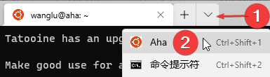
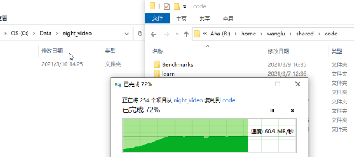
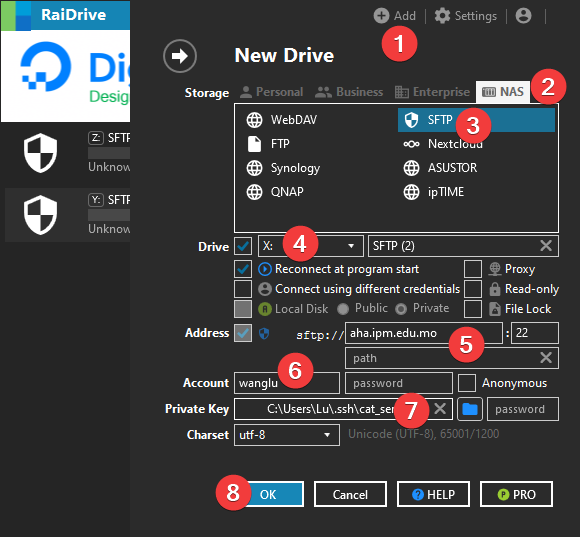
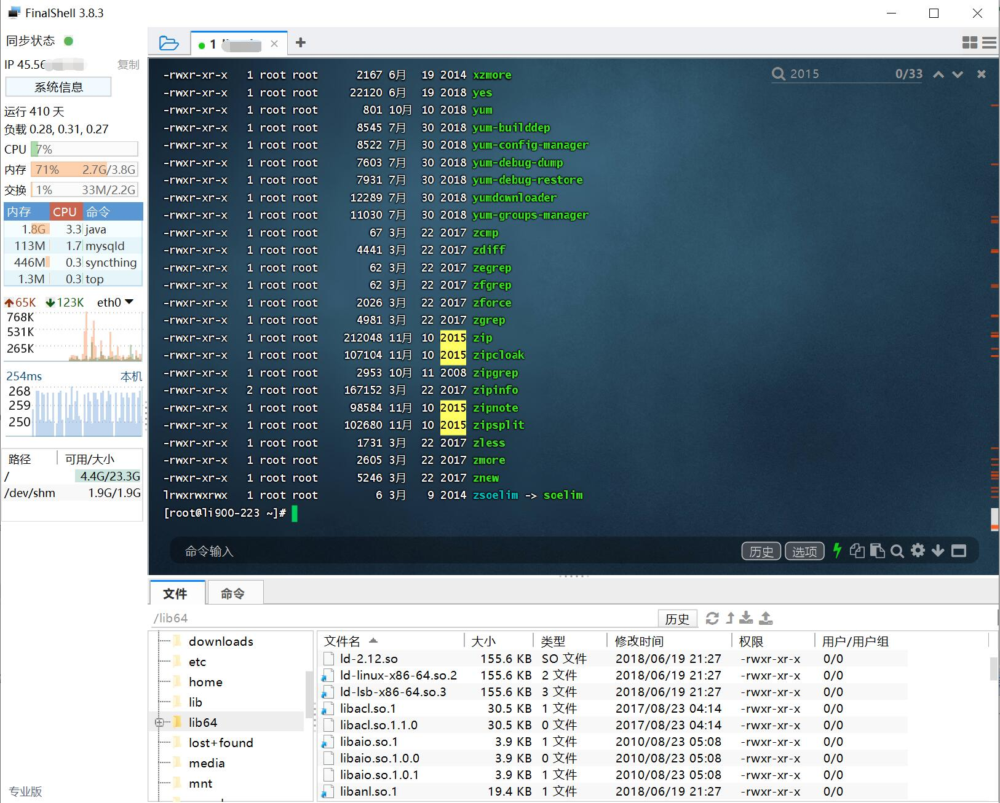
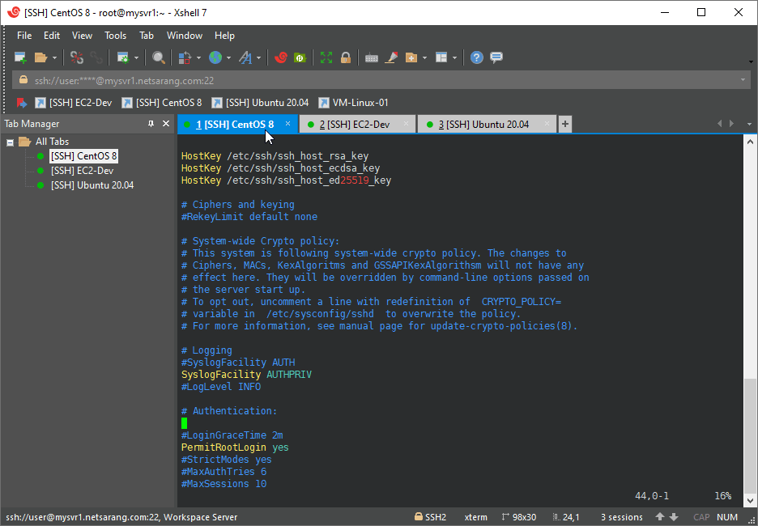
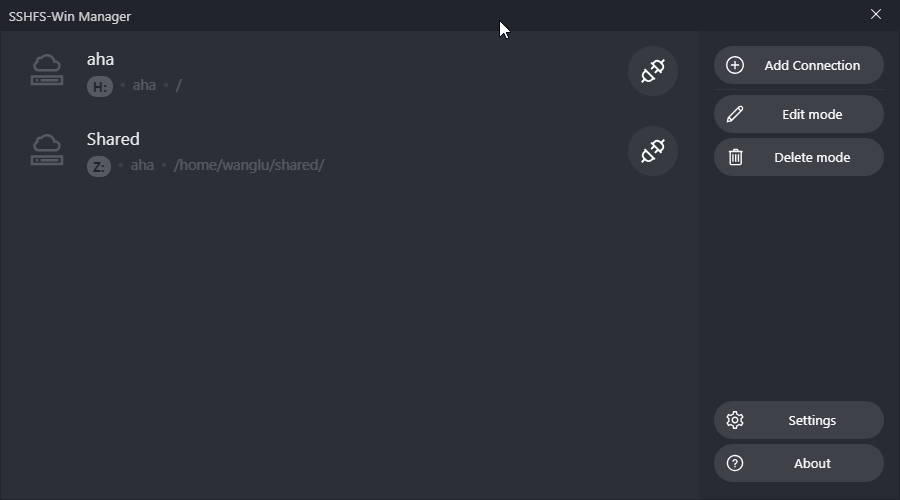

# 连服务器
 


**TLDR**： Windows Terminal + RaiDrive。 或者用 FinalShell（国产）。


## 用 Windows Terminal 连接服务器

### 基础要求

需要主动获取信息的能力。这包括：能阅读屏幕上的文字、能通过搜索引擎学习新事物。

如果你是新手或完全没用过Linux，推荐阅读 [提问的智慧]。

[提问的智慧]: https://github.com/ryanhanwu/How-To-Ask-Questions-The-Smart-Way/blob/main/README-zh_CN.md

### 前提检查

你需要有一个账号，这需要向管理员咨询和申请。 如果你不知道如何联系管理员——你可能不是服务器服务的对象。

如果你没有注册，需要先准备一个专用的 SSH key，
这可以通过软件 `PuTTYgen` 生成，也可以在相关网站在线生成。

请参阅：[create-ssh-keys]。

[create-ssh-keys]: https://cloud.google.com/compute/docs/connect/create-ssh-keys#windows

本文推荐的软件 Terminal 需要 `*.pem` 格式的私钥。
如果你的私钥是其他格式，如ppk，请参阅：[Windows – 将 .ppk 文件转换为 .pem 文件]。

[Windows – 将 .ppk 文件转换为 .pem 文件]: https://aws.amazon.com/cn/premiumsupport/knowledge-center/convert-pem-file-into-ppk/

### 安装

在[Windows应用商店]就能安装它，这需要你有微软账号。

你也可以在 [Terminal 的 Github 发布页] 下载安装包。

[Windows应用商店]: https://aka.ms/terminal

[Terminal 的 Github 发布页]: https://github.com/microsoft/terminal/releases

### 配置

打开设置（标签页下三角>设置; 或者用快捷键 ``Ctrl + ,`` ）。

目前，Terminal支持使用GUI添加新配置，请按引导添加，注意在命令行处填写

```shell
ssh -i C:/path/your_ssh_key username@aha.ipm.edu.mo
```

其中 `C:/path/your_ssh_key` 是你SSH私钥文件的位置， `username` 是你的用户名

你也可以通过修改设置的文件来添加新连接。
打开设置的json文件，在约32行，profiles > list 处，向其添加一组配置：

```json
{
    "name": "Aha",
    "commandline": "ssh -i C:/path/your_ssh_key username@aha.ipm.edu.mo",
    "guid": "{xxxxxxxx-xxxx-xxxx-xxxx-xxxxxxxxxxxx}"
}
```

注意：

- guid 是生成的，可以使用 [Online-guid-generator] ,直接点击按钮“Generate some GUIDs!”，就可以在Results中获取一个guid
- name 配置名称，用于显示
- commandline ssh命令，需要将其中的“C:/path/your_ssh_key”替换为你的ssh key路径，将username替换为你的用户名
- 查看 Terminal 的官方文档，可以获取更详细的配置说明
- 如果 aha 不能用，请尝试另一个登陆节点aloha
- 如果 aha.ipm.edu.mo 不能解析DNS，请尝试用 aha 的IP登录

[Online-guid-generator]: https://www.guidgenerator.com/online-guid-generator.aspx

其他的配置选项请参考 [Terminal 的官方文档]。

[Terminal 的官方文档]: https://docs.microsoft.com/zh-cn/windows/terminal/customize-settings/profile-general

### 建立连接

如图所示：



至此，我们成功访问服务器了。

如果输入命令 `hostname` ，服务器会输出节点名 `aha`。

## 上传下载文件

可以用 RaiDrive 将服务器映射为一个盘（网络驱动器）。

RaiDrive：<https://www.raidrive.com/>

    CLI中，可以用命令 `scp` 传文件，但是手打命令相对麻烦。

效果图如下所示，可以映射服务器的某个目录为一个硬盘，方便的操作文件。




由于服务器在内网，所以文件操作速度较快。


### 安装和配置

RaiDrive 使用第三方服务分发软件：

下载地址1： <https://raidrive.en.uptodown.com/windows/download>

下载地址2： <https://www.softpedia.com/get/Tweak/System-Tweak/RaiDrive.shtml>

可以按下图进行配置。



在 ``4`` ，要选择映射的目标硬盘盘符，可以选择你喜欢的。

在 ``5`` ，可以将路径映射为指定目录，如 `/home/you/shared` (将 you 替换为你的用户名)，更方便的访问指定目录。

至此，可以方便的利用windows提供的用户界面操作服务器上的文件了。

可以尝试新建、删除文件，尝试从本机复制文件到服务器上了。


### 存在的问题

RaiDrive 会开启多个SSH连接，这可能造成你的SSH连接数量超过服务器限制。

如果你的连接数超过限制，SSH 欢迎信息会提示你正在使用的连接数量。

如果你发现SSH连接过多，可以重启RaiDrive的映射。

你也可以在服务器上 kill 对应的 SSH 连接进程。

如果你的SSH连接数量超过限制，已经无法登录，可以联系管理员请求帮助。

### 教育版 RaiDrive

可以用学校邮箱申请 [RaiDrive的教育版]。

教育版增加了：Multi-user File Lock 和 Fast Copy, Move, Delete

[RaiDrive的教育版]: https://www.raidrive.com/plans/education

## 同类工具推荐

### FinalShell

官方网站： <https://www.hostbuf.com/t/988.html>

国产软件，SSH 工具中的瑞士军刀，功能全面，新手友好。

核心特性：

- 多标签页
- sftp，终端同屏显示，同步切换目录
- 打包传输，自动压缩解压
- 各种指标监控，内存，Cpu，延迟，路由，硬盘，进程监控
- 内置文本编辑器，直接编辑服务器文件
- 多个配色方案，自定义背景图片
- 命令自动提示，智能匹配，快捷命令面板
- 多平台支持

如果购买高级版或专业版，有更高级的特性，参见官方文档。



### XShell + XFTP

对家庭和教育免费，需要申请：<https://www.netsarang.com/zh/free-for-home-school/>

经典强大的工具



### SSHFS-Win Manager

Github仓库：<https://github.com/evsar3/sshfs-win-manager>

相比于 RaiDrive，它更省SSH链接数。但性能不如 RaiDrive。

如果你打算在本地IDE中实时编辑服务器上的项目，不要使用它。


