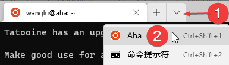
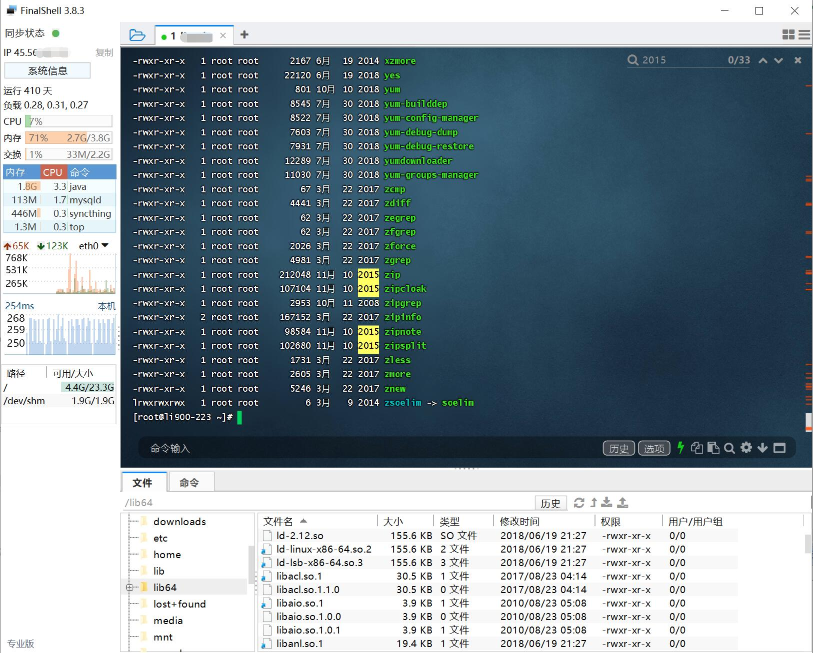
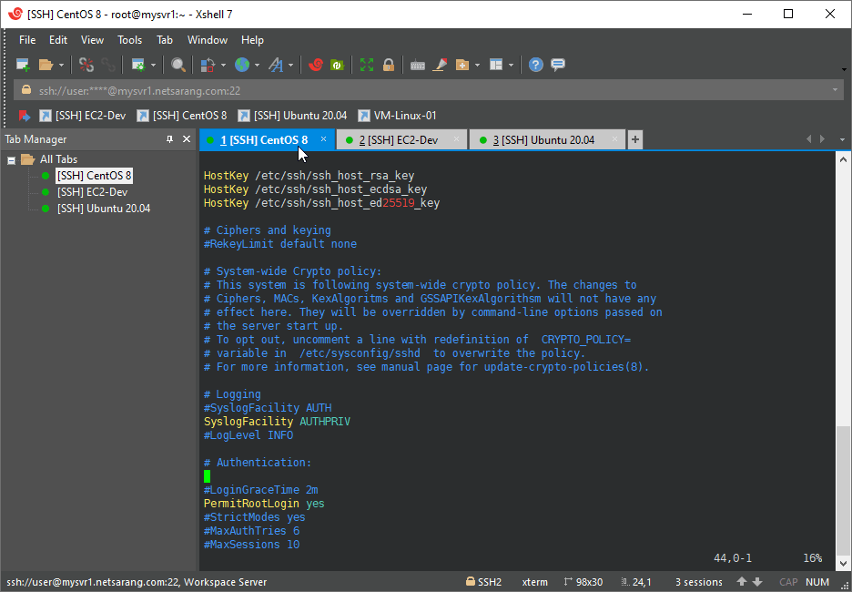

.. note: how to connect to mpi server

===========
连服务器
===========

.. image:: https://visitor-badge.glitch.me/badge?page_id=lu.readthedocs.io.ServerNote.连服务器

TLDR： Windows Terminal + RaiDrive。 或者用国产的 FinalShell。

--------------------------------
用 Windows Terminal 连接服务器
--------------------------------

前提检查
==========

你需要一个账号，这需要向管理员咨询和申请。

如果你没有注册，需要先准备一个专用 SSH key，
这可以通过PuTTYgen生成，请参阅官方文档账号注册的部分。

（官方文档指向了 这个链接_ ）

.. _这个链接: https://cloud.google.com/compute/docs/connect/create-ssh-keys#windows

Terminal 需要*.pem格式的私钥。

如果你的私钥是其他格式，如ppk，请按照 这个网页_ 中，
有关“Windows – 将 .ppk 文件转换为 .pem 文件”的部分转换格式。

.. _这个网页: https://aws.amazon.com/cn/premiumsupport/knowledge-center/convert-pem-file-into-ppk/

安装软件
==========

在Windows应用商店就能安装它，点击这里_ 打开应用商店。这可能需要你有微软账号。

此外，你也可以在 它的github页面_ 下载安装包。

.. _点击这里: https://aka.ms/terminal

.. _它的github页面: https://github.com/microsoft/terminal/releases

配置 Terminal
================

打开设置（标签页下三角>设置; 或者用快捷键 ``Ctrl+逗号`` ）。

目前，Terminal的添加配置支持GUI，可以按引导添加，注意在命令行处添加

.. code-block:: bash

    ssh -i C:/path/your_ssh_key username@aha.ipm.edu.mo

其中 `C:/path/your_ssh_key` 是你SSH私钥文件的位置， `username` 是你的用户名

你也可以修改设置的Json文件来添加新连接。
打开设置的json文件，在约32行，“list”处，向其添加一组配置：

.. code-block:: json

	{
		"guid": "{a399abee-686e-4f2c-9ff4-18143cb2f0ea}",
		"hidden": false,
		"name": "Aha",
		"commandline": "ssh -i C:/path/your_ssh_key username@aha.ipm.edu.mo"
	}

注意：

- guid 是生成的，可以使用 online-guid-generator_ ,直接点击按钮“Generate some GUIDs!”，就可以在Results中获取一个guid
- hidden 是否隐藏（可以将不需要显示的配置设置为true）
- name 配置名称，用于显示
- commandline ssh命令，需要将其中的“C:/path/your_ssh_key”替换为你的ssh key路径，将username替换为你的用户名
- 查看 Terminal 的官方文档，可以获取更详细的配置说明

.. _online-guid-generator: https://www.guidgenerator.com/online-guid-generator.aspx

其他的配置选项请参考文档：https://docs.microsoft.com/zh-cn/windows/terminal/customize-settings/profile-general

建立连接
==========

如图所示：

至此，我们成功访问服务器了。

你可以输入命令 ``hostname`` ，服务器会输出名字 ``aha``。

-------------
上传下载文件
-------------

我用 RaiDrive 将服务器映射为硬盘。

RaiDrive：https://www.raidrive.com/

最终结果如图所示，服务器上的目录被我们映射成为一个硬盘，方便的操作文件。

.. image:: pics/N1上传下载文件1.png

.. image:: pics/N1上传下载文件2.png

安装和配置
============

可以在此处下载： https://raidrive.en.uptodown.com/windows/download

（这不是RaiDrive网站，因为 RaiDrive 使用第三方下载服务分发软件）

可以按下图进行配置。

.. image:: pics/N1安装和配置.png

在 ``4`` ，要选择映射的目标硬盘盘符，可以选择你喜欢的（除了C）。

在 ``5`` ，可以将路径映射为指定目录，如/home/username/shared (将username替换为你的用户名)，更方便的访问指定目录。

可以多次配置，每个配置映射到不同路径，便于快速访问多个目录。

至此，可以方便的利用windows提供的用户界面操作服务器上的文件了。

可以尝试新建、删除文件，尝试从本机复制文件到服务器上了。

安装和配置
---------------

RaiDrive 会开启多个SSH连接，这可能造成你的SSH连接数量超过服务器限制。

在SSH登录服务器时，欢迎信息中会提示你正在使用的连接数量（5个以上才会显示）。

如果你发现SSH连接过多，可以在RaiDrive中关闭并重新打开一个映射。

你也可以在服务器上kill对应的SSH连接。

如果你的SSH连接数量超过限制，已经无法登录，可以联系管理员请求帮助。

教育版 RaiDrive
--------------------

可以用EDU邮箱注册并申请，教育版增加了：Multi-user File Lock 和 Fast Copy, Move, Delete

地址：https://www.raidrive.com/plans/education

----------------
同类工具推荐
----------------

通过调研、试用可以选择最适合你的工具。

FinalShell
=============

官方文档： https://www.hostbuf.com/t/988.html

SSH工具中的瑞士军刀，国产。
对刚接触SSH的用户非常友好, 一个工具搞定全部需求。

主要特性：

- 多标签页
- sftp，终端同屏显示，同步切换目录
- 打包传输，自动压缩解压
- 各种指标监控，内存，Cpu，延迟，路由，硬盘，进程监控
- 内置文本编辑器，直接编辑服务器文件
- 多个配色方案，自定义背景图片
- 命令自动提示，智能匹配，快捷命令面板
- 多平台支持

如果购买高级版或专业版，有更高级的特性（我买了挺香的），参见官方文档。

XShell + XFTP
================

对家庭和教育免费，申请地址：https://www.netsarang.com/zh/free-for-home-school/

经典强大的工具（虽然有过后门事件）

SSHFS-Win Manager
====================

相比于 RaiDrive，它更省SSH链接数。但性能不如 RaiDrive。
