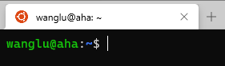
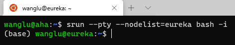
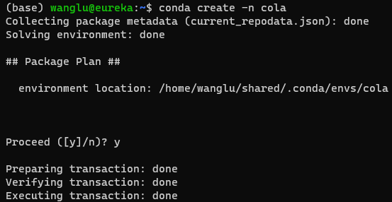
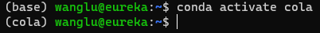
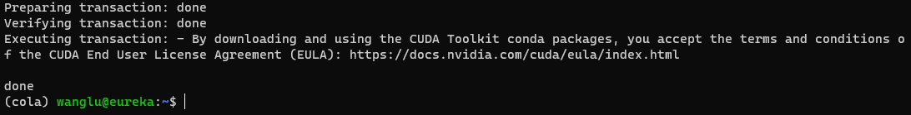
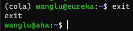
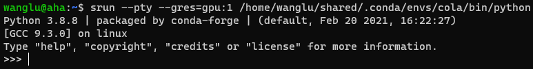
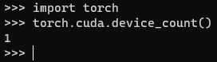
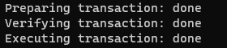

# 配环境（PyTorch）


下文会基于 Conda 逐步安装 PyTorch。

首先要登录到服务器的计算节点，再配置环境。

    只有计算节点提供 Conda。Conda环境通过存储节点共享到所有计算节点。

    要更深入的了解服务器上的Conda配置细节，请咨询管理员。

## 登录服务器

即登录到Aha/Aloha等登陆节点。此处以Aha为例。

用户可以通过Aha向其他计算节点提交计算任务来运行程序。



## 通过Aha访问计算节点

输入命令：`sit`

它在 ~/.bash_aliases 定义，如果没有，替代命令是：`srun --pty bash -i`

如果你在Aloha，可以使用命令 `cp -i /shine-cluster/login/etc/skel/.bash_aliases ~` 使用服务器提供的 `.bash_aliases `。重新连接服务器以应用新的 `.bash_aliases` 



注意到显示的 ``wanglu@aha`` 会变成 ``(base)wanglu@eureka`` ,或者 ``(base)wanglu@tatooine`` 等等

``name@eureka`` 意味着你正在使用 ``eureka`` 服务器

``name@tatooine`` 意味着你正在使用 ``tatooine`` 服务器

## 创建名为 cola 的新环境

输入命令：``conda create -n cola``

会提示 ``Proceed ([y]/n)?`` ，请阅读安装计划，输入 y 同意以此计划创建新环境。



## 激活新环境

输入命令：``conda activate cola``



## 安装PyTorch

Conda 倾向于安装新版本。如果 PyTorch 没有对应最新版 CudaToolkit 的 Build，Conda 会自动安装 CPU 版 PyTorch 以使用新版本的 CudaToolkit。

因此先搜索目前 PyTorch 支持的 CudaToolkit 版本：`conda search pytorch -c pytorch`

输出如：

```
# Name   Version  Build  Channel
...
pytorch  1.11.0 py3.9_cuda11.3_cudnn8_0  pytorch
pytorch  1.11.0 py3.9_cuda11.5_cudnn8_0  pytorch
...
pytorch  1.11.0 py3.10_cuda11.3_cudnn8_0  pytorch
pytorch  1.11.0 py3.10_cuda11.5_cudnn8_0  pytorch
...
```

其中， Build 一列描述了其支持的 CudaToolkit 版本。 如最后一行的 Build 支持 Python3.10 和 CudaToolkit 11.5。

如果你需要安装其他版本，请对应修改下列命令给出的版本号。

根据这一信息，
输入命令：``conda install python=3.10 pytorch torchvision cudatoolkit=11.5 -c conda-forge -c PyTorch``

这个命令意味着从 conda-forge 安装包，请访问 conda-forge.org 确认你了解她是什么。

> 如果不想使用conda-forge，可以使用 ``conda install PyTorch cudatoolkit=11.3 -c PyTorch``。
这里使用 11.3 是因为 Conda Channel 对 CudaToolkit 的更新比较慢，目前只支持到11.3。因此当你安装时，请确认目前提供的 CudaToolkit版本。

稍作等待，在提示 `Proceed ([y]/n)?` 时，请检查安装计划是否符合预期。如 Python 版本，PyTorch 的版本是否支持 CUDA 等。

确认无误后，输入 `y` 确认安装。

如果安装计划有问题，如Python的版本过高/低，可以手动设置版本号，如 ``conda install python=3.8 PyTorch ...`` 。

安装很快，但下载慢。服务器支持多用户共享Conda Cache，如果你安装的包有本地缓存，程序会自动跳过其下载过程。

如果没有缓存，安装PyTorch可能需要约二十分钟。



## 验证安装

首先需要退出计算节点，回到aha：

输入命令：``exit``



警告：下一操作将会要求服务器提供一个GPU使用

输入命令：``sit -g`` (如果提示没有此命令请输入`srun --pty --gres=gpu:1 bash -i`)

这一命令会要求slurm给你使用一个GPU，并在对应节点进入bash。

输入 ``hostname`` 可以查看你进入的节点。

输入 ``nvidia-smi`` 可以查看申请的GPU的状态。

输入 ``python`` 进入 Python 交互式模式，可以直接输入Python代码，回车立即执行



输入Python代码：``import torch``

继续输入：``torch.cuda.device_count()`` 来查看PyTorch检测到的CUDA设备数量（即GPU数量）。



如果程序如图运行并输出1（因为上文只要求了一块GPU），说明已经成功安装了PyTorch环境，能用GPU加速计算。

退出python，请输入: exit() 或 快捷键 Ctrl + D。

## 安装更多Python Package

如果一切顺利，您目前已经拥有了一个装有PyTorch的机器学习环境。

通常，我们还需要安装更多的包，以下步骤不是必须的，但可以安装额外的包。

首先，进入计算节点的交互 Bash ，输入命令：``srun --pty bash -i``

激活环境 cola，输入命令：``conda activate cola``

安装包matplotlib, 输入命令：``conda install matplotlib``

或者从 conda-forge channel 安装 matplotlib, 输入命令：``conda install matplotlib -c conda-forge``

会遇到提示 `Proceed ([y]/n)?`，在确认安装计划符合预期后，输入回车或y确认继续执行。



如需安装其他包，命令形如：``conda install 包名``

例如：

```shell
    conda install pillow
    conda install numpy
    ...
```
