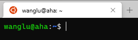
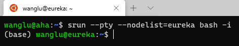
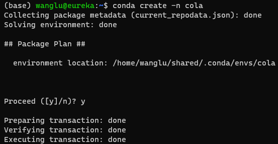
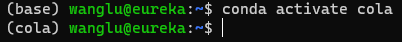
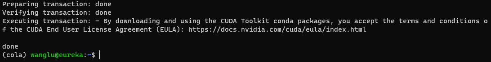
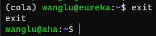
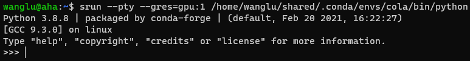
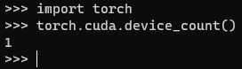
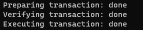

.. mpi server note index page

.. image:: https://visitor-badge.glitch.me/badge?page_id=lu.readthedocs.io.ServerNote.配环境PyTorch

========================
配环境（PyTorch）
========================

下文会逐步配置一个基于PyTorch机器学习环境。

首先要登录到服务器的计算节点，再配置环境。

    这是因为登录节点没有计算环境。
    所有计算节点的环境是共享的，意味着只需要配置一次环境就可以在不同的节点使用了。

登录服务器
==============

即登录到Aha，用户可以通过Aha向其他计算节点提交计算任务来运行程序。

通过Aha访问计算节点
=================

输入命令：`srun --pty bash -i`

注意到显示的 ``wanglu@aha`` 会变成 ``(base)wanglu@eureka`` ,或者 ``(base)wanglu@tatooine`` 等等

``name@eureka`` 意味着你正在使用 ``eureka`` 服务器

``name@tatooine`` 意味着你正在使用 ``tatooine`` 服务器

创建名为 cola 的新环境
====================

输入命令：``conda create -n cola``

会提示 ``Proceed ([y]/n)?`` ，请阅读安装计划，输入 y 可以确认创建环境。

激活新环境
=========

输入命令：``conda activate cola``

安装PyTorch
===========

输入命令：``conda install PyTorch torchvision cudatoolkit -c conda-forge -c PyTorch``

这个命令意味着从 conda-forge 安装包，请访问 conda-forge.org 确认你了解她是什么。

如果不想使用conda-forge，可以使用 ``conda install PyTorch torchvision cudatoolkit -c PyTorch`` ，
但cudatoolkit版本可能会低一些

稍作等待，在提示Proceed ([y]/n)? 时，请检查安装计划是否符合预期。如Python版本，PyTorch的版本是否支持CUDA等。

确认无误后，输入 y 确认安装。

如果安装计划有问题，如Python的版本过高/低，可以手动设置版本号，如 ``conda install python=3.8 PyTorch ...`` 。

安装很快，但下载慢。服务器支持多用户共享conda cache，如果你安装的包有本地缓存，程序会自动跳过其下载过程。

安装可能需要几分钟到二十分钟(在服务器的高速互联网恢复前，这可能需要更长时间)。

验证安装
=======

首先需要退出eureka，回到aha：

输入命令：``exit``

警告：下一行操作将会要求服务器提供一个GPU使用

输入命令：``srun --pty --gres=gpu:1 bash -i``

这一命令会要求slurm给你使用一个GPU，并在对应节点进入bash。

可以输入 ``hostname`` 查看你进入的节点。

可以输入： ``nvidia-smi``

查看申请的GPU的状态。

输入命令：``python``

进入python交互式模式，可以直接输入Python代码，回车立即执行

输入Python代码：``import torch``

继续输入：``torch.cuda.device_count()`` 来查看PyTorch检测到的CUDA设备数量（即GPU数量）。

如果程序如图运行并输出1（因为上文只要求了一块GPU），说明已经成功安装了PyTorch环境，能用GPU加速计算。

退出python，请输入: exit() 或 快捷键 Ctrl + D。

安装更多Python Package
=====================

如果一切顺利，您目前已经拥有了一个装有PyTorch的机器学习环境。

通常，我们还需要安装更多的包，以下步骤不是必须的，但可以安装额外的包。

首先，进入计算节点的交互 Bash ，输入命令：``srun --pty bash -i``

激活环境 cola，输入命令：``conda activate cola``

安装包matplotlib, 输入命令：``conda install matplotlib``

或者从 conda-forge channel 安装 matplotlib, 输入命令：``conda install matplotlib -c conda-forge``

会遇到提示Proceed ([y]/n)?，在确认安装计划符合预期后，输入回车或y确认继续执行。

如需安装其他包，命令形如：``conda install PackageName``

例如：

.. code-block:: bash

    conda install pillow
    conda install numpy
    ...

相关背景和解释
=============

配置科研机器学习环境，本质上是安装编程语言、机器学习框架和开发工具，通常还包括用于GPU加速的CUDA Toolkit。

具体方案通常是使用Conda来安装Python + PyTorch/TensorFlow + CUDA。（这种组合最常用。 参考资料_ ）

.. _参考资料: https://zhuanlan.zhihu.com/p/93563377

1. 为啥用 Python
----------------

    人生苦短，我用Python。

机器学习、数据科学等社区广泛使用 Python。

Python 容易学习、编码和阅读。关注实现想法，而非编码细节。它有庞大的活跃的开源社区，提供了无数高效、便利的解决方案。

虽然Python相对慢，但是可以使用C加速，计算瓶颈通常可以使用高性能计算库加速。

2. 为啥不用 Matlab
-----------------

- Python是相关领域的首选语言。ML框架通常支持C++/Java/Python。
- 早期Matlab对ML支持不好。加之软件闭源，商业授权等等，缺乏竞争力。
- 目前Matlab对机器学习的支持已经很好了，但蛋糕被别人吃完了。

3. 为啥用 PyTorch 和/或 TensorFlow
---------------------------------

大量的机器学习研究使用 PyTorch 或 TensorFlow ，可以算领域必备技能了。

相对的，用其他框架的新 Paper 越来越少了。 参考资料_

.. _参考资料: https://zhuanlan.zhihu.com/p/93563377

在 PapersWithCode_ ，也能发现大量的论文使用PyTorch和TensorFlow，而非其他。

.. _PapersWithCode: https://paperswithcode.com/

3. 为啥用 Conda
--------------

方便，省心。

可以不去管 配置环境 这个老大难问题的细节。

**Conda**，我们通常指Anaconda的个人版(Individual Edition)。

它是强大的数据科学工具包（data science toolkit），
主要包括Python分发平台、包管理工具和软件环境管理三个部分
（Python distribution platform, Cloud-based packages repository, Software Environments Manage）。

**MiniConda**

MiniConda是Conda的免费最小发行包。可以基于此快速配置Python环境。在个人电脑上配置Python环境，使用MiniConda非常方便。

不过在MPI 的 Server上，已经配置好了Conda，可以直接使用Conda管理和配置环境。
