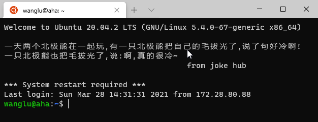

# 跑代码


    
```{admonition} 注意
:class: warning

下文将从零开始运行一份Python代码，包括对GPU资源的申请。如果集群目前暂停服务或满载，可能无法完成。
```

## 背景

集群提供了多个计算节点，每个节点有多块GPU。

这么多GPU要如何分配和使用呢？ 用 Slurm。

SLURM：是一种可扩展工作负载管理器，被全球超级计算机中心广泛采用。

Job：任务，资源设置和程序，用于分配资源和运行。如：“Hi~ o(*￣▽￣*)ブ，Slurm！来两块显卡，跑这个代码。”

## 跑代码

### 登录服务器

登录成功后可以看到每日笑话，如图：



### 获取例子文件

复制以下命令，在终端运行，这会下载例子文件。

```shell
wget -O ~/shared/hello_slurm.sh https://github.com/Lu-MPI/MPI-Server-Note/raw/main/hello_slurm.sh
wget -O ~/shared/hello_python.py https://github.com/Lu-MPI/MPI-Server-Note/raw/main/hello_python.py
```

可以通过命令 `cat ~/shared/hello_slurm.sh` 查看文件内容

可以通过命令 `cat ~/shared/hello_python.sh` 查看文件内容

### 运行代码

以下命令将会申请1个CPU和1个GPU，并运行hello_python代码。

```shell
cd ~/shared
sbatch hello_slurm.sh
```

如果看到输出：Submitted batch job xxxx。 意味着你已经成功提交任务了！

### 查看结果

用 `squeue` 命令查看任务运行状态。(例子会运行30秒)

例子会输出两个文件

- ~/shared/demo_slurm_python_output.txt Python程序保存的文件。
- ~/shared/hello_slurm_output.txt 输出重定向文件，程序中的print会输出到这里。可以在hello_slurm.sh中找到更多信息

更多细节请阅读刚才下载的例子文件，它们在你的用户目录下shared文件夹中。例如: /home/yourname/shared/

例子有两个文件 hello_slurm.sh和hello_python.py。

- hello_slurm.sh 是启动脚本，可以通过修改它改变配置和要运行的文件
- hello_python.py 是要运行的代码。

更多信息可以阅读这俩文件，有注释。
