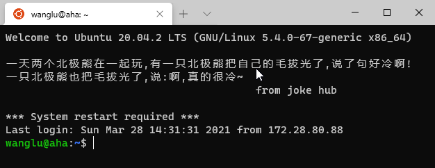
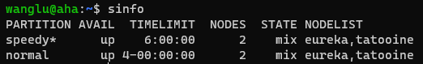
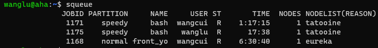
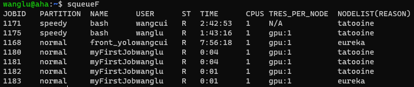
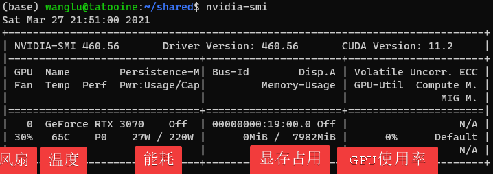

.. 跑代码

.. image:: https://visitor-badge.glitch.me/badge?page_id=lu.readthedocs.io.ServerNote.跑代码

========================
跑代码
========================

.. note::
    下文将从零开始运行一份Python代码，包括对GPU资源的申请。如果服务器目前暂停服务或满载，可能无法完成。

背景
========================

集群提供了多个计算节点，每个节点有多块GPU。

这么多GPU要如何分配和使用呢？ 用 Slurm。

SLURM：是一种可扩展工作负载管理器，被全球超级计算机中心广泛采用。

Job/任务：资源设置和程序，用于分配资源和运行。如：“Slurm！来两块显卡，跑这个代码。”

跑代码
========================

登录服务器
------------------

登录成功后可以看到每日笑话，如图：

获取例子文件
------------------

复制以下命令，在终端运行，这会下载例子文件。

.. code-block:: bash

    wget -O ~/shared/hello_slurm.sh https://github.com/Lu-MPI/MPI-Server-Note/raw/main/hello_slurm.sh
    wget -O ~/shared/hello_python.py https://github.com/Lu-MPI/MPI-Server-Note/raw/main/hello_python.py

可以通过命令 `cat ~/shared/hello_slurm.sh` 查看文件内容

可以通过命令 `cat ~/shared/hello_python.sh` 查看文件内容

运行代码
------------------

以下命令将会申请1个CPU和1个GPU，并运行hello_python代码。

.. code-block:: bash

    cd ~/shared
    sbatch hello_slurm.sh

如果看到输出：Submitted batch job xxxx。 意味着你已经成功提交任务了！

查看结果
------------------

用 `squeue` 命令查看任务运行状态。(例子会运行30秒)

例子会输出两个文件

- ~/shared/demo_slurm_python_output.txt Python程序保存的文件。
- ~/shared/hello_slurm_output.txt 输出重定向文件，程序中的print会输出到这里。可以在hello_slurm.sh中找到更多信息

更多细节请阅读刚才下载的例子文件，它们在你的用户目录下shared文件夹中。例如: /home/yourname/shared/

例子有两个文件 hello_slurm.sh和hello_python.py。

- hello_slurm.sh 是启动脚本，可以通过修改它改变配置和要运行的文件
- hello_python.py 是要运行的代码。

更多信息可以阅读脚本文件中的注释。

报错怎么办?
==============

下文列出了一些 slurm 常见问题的检查方案。

slurm 是不是挂了
------------------

用 `sinfo` 查看服务器状态

我们有两个分区， `speedy` （默认）和 `normal` 。

`speedy` 分区一个任务的最长运行时间为6小时。
`normal` 分区一个任务的最长运行时间为96小时。

超出最长运行时间后程序会被强制停止。要运行更长时间，需要保存中间结果并再次运行任务。

每个节点都有自己的状态：

- `idle` (空载)
- `mix` (部分资源可用）
- `alloc` (满载)
- `drain` (故障)
- `down` (下线)

如果你认为节点有问题，请告知管理员。

现在有多少GPU能用？
--------------------

使用 `squeue` 或 `squeueF` 命令查看服务器状态

以上命令将会显示队列中的任务。包括任务编号，分区，名称，用户，状态，运行时间，节点数量和名称。

squeueF增加了CPU、GPU的使用数量，这意味着用户可以在运行前计算剩余的GPU数量。

当有多个任务运行时，可以观察到它们使用GPU的数量。以便于确定自己当前可以使用的GPU数量

如上图，tatooine上的任务已经占用了4块GPU，因此没有空余GPU了。 但是eureka上仅有2块GPU被使用，因此还空余8块GPU可供使用。

如果你没有squeueF，可以运行

.. code-block:: bash

    squeue --Format "JobID:6,Partition:8,Name:16,UserName:8,StateCompact:2,TimeUsed:9,NumCPUs:3,tres-per-node:10,ReasonList"

程序跑的慢？可能是GPU利用不足！
----------------------------------------

首先，使用squeue 命令获取你运行中任务的编号（JobID）。

运行以下命令，注意替换 “你的任务编号”

.. code-block:: bash

    srun --pty --jobid 你的任务编号 bash -i

之后，可以使用如nvidia-smi, gpustat等命令查看GPU的使用情况。

如上图，显存利用为0，GPU使用率为0，说明程序完全没有利用GPU做运算。
