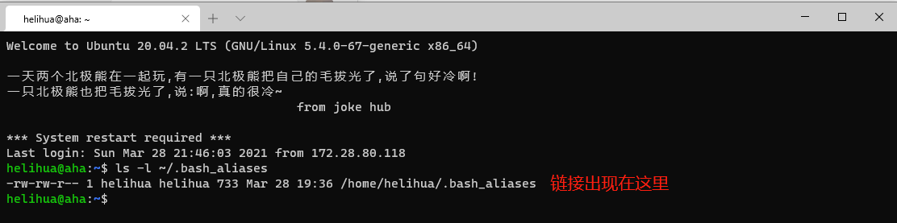
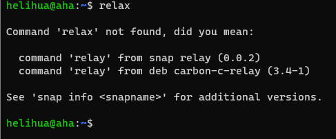

.. Bash Aliases

.. image:: https://visitor-badge.glitch.me/badge?page_id=lu.readthedocs.io.ServerNote.BashAliases

========================
使用技巧: Bash Aliases
========================

作者：Lisa_

.. _Lisa: https://github.com/Lisa-MPI

**Bash别名拯救你的工作低效率！**

厌倦了一遍又一遍地输入相同的长命令？Bash别名可以为你创造一个与众不同的世界。

它是一种用新的命令补充或覆盖Bash命令的方法，说白了，就是把你记不住的命令重命名为你记得住的。

查看.bash.aliases文件权限
=========================================

登录服务器后，复制以下命令，查看.bash.aliases文件权限。

.. code-block:: bash

    ls -l ~/.bash_aliases

如果看到输出以下图片，直接跳到操作3

如果看到.bash.aliases文件后有链接至/home/qiqig/mpi-servers/login/etc/skel/.bash_aliases，则需要先进行操作2。

(选做)取消 .bash.aliases 文件链接
=========================================

取消.bash.aliases文件链接(删除文件)，并保存文件内容至新的.bash.aliases文件。

如果将来bash_aliases文件链接的地址有变化，请以新地址为准

.. code-block:: bash

    unlink ~/.bash_aliases
    cat /home/qiqig/mpi-servers/login/etc/skel/.bash_aliases > ~/.bash_aliases

添加自定义Bash别名
=========================================

(1) 添加Bash别名之前需要确定重命名名称是否已存在。

直接输入重命名名称即可，不存在的名字会直接显示Command 'xxx' not found

(2) 用以下格式添加需要重命名的命令，直接在下方添加即可，不需要修改已存在的命令

注意替换文字部分

.. code-block:: bash

    alias 重命名名称='原始命令'

！注意：等号前后不能有空格

(3) 添加完重命名命令后，记得保存文件

重命名查看服务器状态的命令，运行下面的命令后，只需要简短的squeueF即可查询服务器状态

.. code-block:: bash

    alias squeueF='squeue --Format "JobID:8,Partition:11,Name:10,UserName:10,StateCompact:4,TimeUsed:11,NumCPUs:5,tres-per-node:15,Nice:6,PriorityLong:12,ReasonList"'

测试命令是否重命名成功
=========================================

    修改的 .bash.aliases 文件将在下次登录生效。

首先我们需要重新登录服务器，然后输入简化的命令，最后查看结果是否与原命令相同。
