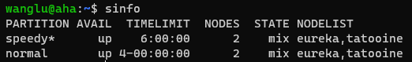
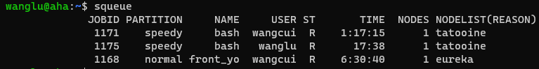
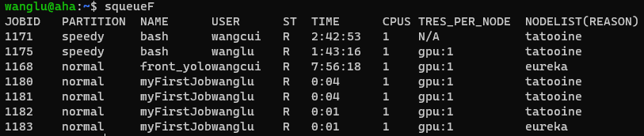
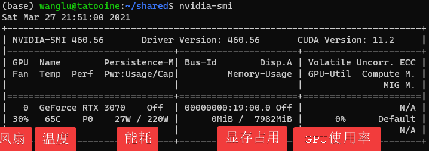

# 常见问题

## 机器学习环境相关

配置科研机器学习环境，本质上是配置编程语言、机器学习框架安装和开发工具，通常还包括用于加速的 CUDA Toolkit 。

具体方案推荐用 Conda 来安装 Python + PyTorch/TensorFlow + CUDA（这种组合最常用。 [参考资料](https://zhuanlan.zhihu.com/p/93563377) ）。

因为 Conda 可以帮助管理软件环境，如果使用 pip，就需要手动选择CUDA版本、安装和配置，对新手来说效率低、容易出错。

### 为啥用 Python

    人生苦短，我用Python。

机器学习、数据科学等社区广泛使用 Python。

Python 容易学习、编码和阅读。关注实现想法，而非编码细节。它有庞大的活跃的开源社区，提供了无数高效、便利的解决方案。

虽然Python相对慢，但是可以使用C加速，计算瓶颈通常可以使用高性能计算库加速。

### 为啥不用 Matlab

- Python是相关领域的首选语言，有成熟的、活跃的、庞大的开源社区。
- ML框架支持工业界首选的C++/Java/Python，研究和转化应用都方便。
- 早期Matlab对ML支持不好，数据科学社区倾向用Python。
- 闭源商业软件缺乏竞争力，相比于成熟可控的开源社区。

如果你所在领域的主要工具是Matlab，那么可以继续使用Matlab，目前Matlab对ML的支持很好。

### 为啥用 PyTorch 和/或 TensorFlow

大量的机器学习研究使用 PyTorch 或 TensorFlow ，可以算领域必备技能了。

相对的，[用其他框架的新 Paper 越来越少了](https://zhuanlan.zhihu.com/p/93563377)。

在 [PapersWithCode]，也能发现大量的论文使用PyTorch和TensorFlow，而非其他。

[PapersWithCode]: https://paperswithcode.com/

早几年，其他的框架还能插一嘴，但目前科研社区倾向 Pytorch。

### 为啥用 Conda

方便，省心。

可以不去管 配置环境 这个老大难问题的细节。

**Conda**，我们通常指Anaconda的个人版(Individual Edition)。

它是强大的数据科学工具包（data science toolkit），
主要包括Python分发平台、包管理工具和软件环境管理三个部分
（Python distribution platform, Cloud-based packages repository, Software Environments Manage）。

**MiniConda**

MiniConda是Conda的免费最小发行包。可以基于此快速配置Python环境。在个人电脑上配置Python环境，使用MiniConda非常方便。

不过在MPI 的 Server上，已经配置好了Conda，可以直接使用Conda管理和配置环境。


## Slurm 相关

用 `sinfo` 查看服务器状态



我们有两个分区， `speedy` （默认）和 `normal` 。

`speedy` 分区一个任务的最长运行时间为6小时。
`normal` 分区一个任务的最长运行时间为96小时。

超出最长运行时间后程序会被强制停止。要运行更长时间，需要保存中间结果并再次运行任务。

每个节点都有自己的状态：

- `idle` (空载)
- `mix` (部分资源可用）
- `alloc` (满载)
- `drain` (故障)
- `down` (下线)


如果你认为节点有问题，请告知管理员。


## 可用GPU数量

使用 `squeue` 或 `squeueF` 命令查看服务器状态

以上命令将会显示队列中的任务。包括任务编号，分区，名称，用户，状态，运行时间，节点数量和名称。

squeueF增加了CPU、GPU的使用数量，这意味着用户可以在运行前计算剩余的GPU数量。





当有多个任务运行时，可以观察到它们使用GPU的数量。以便于确定自己当前可以使用的GPU数量

如上图，tatooine上的任务已经占用了4块GPU，因此没有空余GPU了。 但是eureka上仅有2块GPU被使用，因此还空余8块GPU可供使用。

如果你没有squeueF，可以运行

```shell
squeue --Format "JobID:6,Partition:8,Name:16,UserName:8,StateCompact:2,TimeUsed:9,NumCPUs:3,tres-per-node:10,ReasonList"
```

## 程序跑的慢

可能是GPU利用不足。

首先，使用 `squeue` 命令获取你运行中任务的编号（JobID）。

运行以下命令，进入任务所在环境

```shell
    srun --pty --jobid 任务编号 bash -i
```

之后，可以使用如nvidia-smi, gpustat等命令查看GPU的使用情况。



如上图，显存利用为0，GPU使用率为0，说明程序完全没有利用GPU做运算。

这一般是程序有其他瓶颈导致的，如CPU计算瓶颈，或者CPU-GPU数据传输瓶颈。
