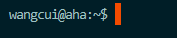
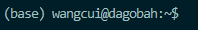

# 配置Docker用于深度学习


## 介绍docker
（Lu:这里太多过于专业的说明，可以简单一点）
Docker 是一个用于开发、发布和运行应用程序的开放平台。
Docker 使您能够将应用程序与基础架构分离，以便您可以快速交付软件。
使用 Docker，您可以像管理应用程序一样管理基础设施。
通过利用 Docker 快速交付、测试和部署代码的方法，您可以显着减少编写代码和在生产环境中运行之间的延迟。
您可以在多个平台上下载和安装 Docker。


Docker容器与虚拟机类似，但二者在原理上不同。
容器是将操作系统层虚拟化，虚拟机则是虚拟化硬件，因此容器更具有便携性、高效地利用服务器。 
容器更多的用于表示 软件的一个标准化单元。
由于容器的标准化，因此它可以无视基础设施（Infrastructure）的差异，部署到任何一个地方。
另外，Docker也为容器提供更强的业界的隔离兼容


## 服务器上配置docker
（Lu:应当说明是登录节点，没有“初始”一说，也不一定是aha，现在我们有aloha了）
进入初始服务器aha：


（Lu:配置docker时不需要显卡；aloha没有sit怎么办）
进入带显卡的服务器(我这里进入的是dagobah)

```shell
    sit -g
```



（Lu:这里在说啥）
第一次运行，没有安装过docker容器说明。

（Lu:可以先给命令后解释，因为这些命令时必要和没有副作用的）
1. 要允许用户单元到start at boot,root必须为帐户启用逗留,即sudo loginctl enable-linger username.
2. 进入/opt/docker/bin目录并执行安装命令

```shell
loginctl enable-linger $USER
dockerd-rootless-setuptool.sh install
```
（Lu:解释为啥这个文件存在）

（Lu:给出截图，下文的命令要说清楚怎么加环境变量的细节，如果用户不会vim，怎么用raidrive等修改文件）
通常会返回两个路径。有两个选项：
    1、每次手动输入这两个路径。
    2、或者直接写入bashrc的环境变量里面

```shell script
    vim .bashrc
    loginctl enable-linger $USER
    export PATH=???
    export DOCKER_HOST=???
```


## dockers的使用

### docker(container)的常用命令
这是一个链接 [docker常用的命令查询网址](https://docs.docker.com/engine/reference/commandline/run/)


docker容器的列表: 
```shell script
docker ps [OPTIONS]
    docker ps -a
```

（Lu:开启是啥意思）
开启dockers容器：
```shell script
docker start [OPTIONS] CONTAINER [CONTAINER...]
    docker start attach my_container
```

重新开启一个或者多个容器
```shell script
docker restart [OPTIONS] CONTAINER [CONTAINER...]
    docker restart my_container
```

（Lu:这里在说啥）
运行一个命令进入容器，运动容器的两种写法
```shell script
docker exec [OPTIONS] CONTAINER COMMAND [ARG...]
    docker container exec -it my_container /bin/bash    
    docker attach my_container
```

（Lu:这里命令有问题）
停止一个或者多个正在运行的程序：example：停止docker容器(三种方式，任选其一)
```shell script
docker stop [OPTIONS] CONTAINER [CONTAINER...]
    docker container stop trackformer
    docker stop my_container
    exit
    ctrl + p + q
```

（Lu:这里说明命令有问题）
创建并运行容器：创建容器并继承image镜像的东西, 根据需求可以有N种写法,申请gpu
```shell script
docker run [OPTIONS] IMAGE [COMMAND] [ARG...]
    docker run -dit --name=my_container ubuntu:18.04 --gpus
    docker run --name my_container u18.04c:v1 --gpus
    docker create -i -t --name my_container u18.04c:v1 --gpus
    docker run --name my_container --rm -i -t ubuntu bash --gpus
```


删除docker容器：两种写法（container的名称或ID）
```shell script
docker rm [OPTIONS] CONTAINER [CONTAINER...]
    docker rm 9e81183e5ec1
    docker rm /redis
```


### 管理镜像的常用命令 镜像(images)的常用命令

查看镜像列表：docker images
```shell script
docker image COMMAND
    docker images
```


拉取ubuntu18.04镜像: 这里是最小化的系统镜像包
```shell script
    docker pull ubuntu:18.04
```


根据容器container创建一个新的镜像打包：
 
```shell script
docker commit [OPTIONS] CONTAINER [REPOSITORY[:TAG]]
    docker commit -a 作者  容器id 容器名: 容器标签
    docker commit -a cui -m "complete u18.04" cbe37b45a22c u18.04c:v1
```
 

删除image镜像：
```shell script
docker image rm [OPTIONS] IMAGE [IMAGE...]
    docker image rm 5a5c46a1ad43
```


### 配置自己的dockers

拉取ubuntu18.04镜像:  （这里是最小化的系统镜像包）
```shell script
    docker pull ubuntu:18.04
```

创建并运行容器，继承image镜像。并挂载文件夹路径： 
```shell script
docker run [OPTIONS] IMAGE [COMMAND] [ARG...]
    docker run --name yolox_container -ti -v /home/wangcui/shared:/shared_disk --gpus all ubuntu:18.04 /bin/bash 

    docker run --name yolox_container -ti -v /home/wangcui/shared:/shared_disk --gpus all ubuntu:18.04 /bin/bash 
```

（Lu:为什么要执行这些命令？分步解说？）
安装完整版的ubuntu
非最小化处理 
```shell script
    unminimize
    sudo apt update && sudo apt full-upgrade
    apt install vim
    sudo passwd
```

## 配置机器学习环境
    miniconda：安装miniconda3,bash [上述文件][.sh](http://xxx.sh)

（Lu:这里命令有问题，安装步骤要写全，或者给引用）
```shell script
    wget https://repo.anaconda.com/miniconda/Miniconda3-latest-Linux-x86_64.sh
    bash https://repo.anaconda.com/miniconda/Miniconda3-latest-Linux-x86_64.sh
```

（Lu:为啥需要重启）
完成后重启容器
```shell script
    docker restart my_container
```

进入到conda安装路径，然后激活环境conda环境：
```shell script
    source /opt/miniconda/bin/activate
```

（Lu:为什么要安装git，后文跑题了）
安装git工具
```shell script
    sudo apt install git
```

获取github项目的例子
```shell script
    git clone [https://github.com/megvii-model/MOTR.git](https://github.com/megvii-model/MOTR.git)
```

安装conda的开发运行版本，优势conda-forge一般是最新的版本
```shell script
    conda install -c conda-forge cudatoolkit-dev
```

如何安装最新的 pip 和 setuptools
```shell script
    pip install --upgrade pip setuptools wheel
```

安装c++的环境,这个包里面有dpkg-dev fakeroot g++ g++-4.6 
    libalgorithm-diff-perl 
    libalgorithm-diff-xs-perl libalgorithm-merge-perl
    libdpkg-perl libstdc++6-4.6-dev libtimedate-perl
  
```shell script
    sudo apt-get install build-essential
```


### 安装自己的虚拟环境


安装虚拟环境
```shell script
    conda create -n trackformer
```


激活虚拟环境：
```shell script
    conda activate trackformer
```

安装pytorch
```shell script
    conda install pytorch torchvision torchaudio cudatoolkit=11.3 -c pytorch
```

